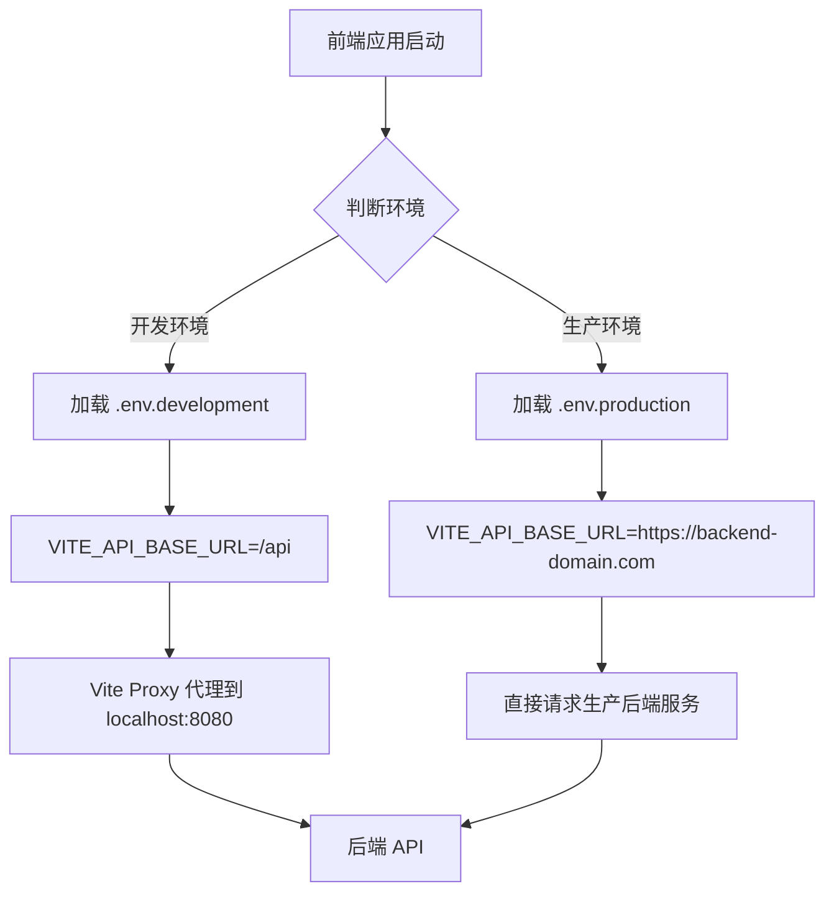

# 前端 API 配置指南

## 📋 目录
- [问题说明](#问题说明)
- [解决方案](#解决方案)
- [环境配置文件](#环境配置文件)
- [本地开发](#本地开发)
- [生产部署](#生产部署)
- [常见问题](#常见问题)

---

## 🔍 问题说明

**原有问题：**
- 开发环境下（`localhost:5173`）运行时，API 请求报错 `ECONNREFUSED`
- 打包后部署到服务器时，API 路径配置不灵活
- 无法同时支持本地开发和线上部署

**根本原因：**
- API 基础路径硬编码为 `/api`
- 没有区分开发环境和生产环境的配置
- Vite 代理配置和生产构建配置混用

---

## ✅ 解决方案

采用 **环境变量 + Vite 代理** 的组合方案：

### 核心思路
1. **开发环境**：使用 Vite 的 proxy 功能，将 `/api` 请求代理到后端服务
2. **生产环境**：使用环境变量配置完整的后端 API 地址
3. **代码层面**：通过 `import.meta.env.VITE_API_BASE_URL` 动态获取 API 地址

### 工作流程



---

## 📁 环境配置文件

### 1. `.env.development` (开发环境)
```bash
VITE_API_BASE_URL=/api
```

**说明：**
- 值设置为 `/api`，表示使用相对路径
- Vite 开发服务器会自动将 `/api` 开头的请求代理到 `http://localhost:8080`
- 浏览器地址栏显示：`http://localhost:5173/api/...`

### 2. `.env.production` (生产环境)
```bash
# 生产环境 API 基础 URL
# 如果使用 Railway、Vercel 等部署平台，请替换为实际的后端服务地址
VITE_API_BASE_URL=https://your-backend-domain.com
```

**说明：**
- 值设置为完整的后端服务地址（不包含 `/api` 前缀）
- 代码中会自动添加 `/api` 前缀
- 打包后的请求直接发送到配置的后端地址

### 3. `.env.example` (配置示例)
```bash
# 开发环境配置示例
# 复制此文件为 .env.development 和 .env.production

# 开发环境 (本地运行)
# VITE_API_BASE_URL=/api

# 生产环境 (部署到服务器)
# VITE_API_BASE_URL=https://your-backend-domain.com
# 或者使用完整的 API 路径:
# VITE_API_BASE_URL=https://your-backend-domain.com/api
```

---

## 💻 本地开发

### 启动步骤

1. **确保后端服务运行**
   ```bash
   # 在后端项目目录下
   cd backend
   mvn spring-boot:run
   # 后端服务运行在 http://localhost:8080
   ```

2. **启动前端开发服务器**
   ```bash
   # 在前端项目目录下
   cd frontend
   npm run dev
   # 前端服务运行在 http://localhost:5173
   ```

3. **访问应用**
   - 打开浏览器访问：`http://localhost:5173`
   - 所有 API 请求会自动代理到 `http://localhost:8080`

### 工作原理

```
浏览器 (localhost:5173)
    ↓ 发起请求 /api/users/login
Vite 开发服务器
    ↓ 代理转发
后端服务 (localhost:8080)
    ↓ 处理请求
返回响应
```

### Vite 代理配置 (`vite.config.js`)
```javascript
server: {
    proxy: {
        '/api': {
            target: 'http://localhost:8080',  // 后端服务地址
            changeOrigin: true,               // 修改请求头中的 Origin
            secure: false,                    // 允许 HTTPS 代理到 HTTP
            rewrite: (path) => path          // 保持路径不变
        }
    }
}
```

---

## 🚀 生产部署

### 部署步骤

1. **修改 `.env.production`**
   ```bash
   # 将 your-backend-domain.com 替换为你的实际后端域名
   VITE_API_BASE_URL=https://your-backend-domain.com
   ```

2. **构建项目**
   ```bash
   npm run build
   ```

3. **部署到服务器**
   - 将 `dist` 目录上传到 Web 服务器
   - 或使用 Vercel、Netlify 等平台一键部署

### 不同部署平台的配置

#### Railway / Render / Heroku
```bash
# .env.production
VITE_API_BASE_URL=https://your-app.up.railway.app
```

#### Vercel
```bash
# .env.production
VITE_API_BASE_URL=https://your-api-domain.vercel.app
```

#### 自有服务器
```bash
# .env.production
VITE_API_BASE_URL=http://your-server-ip:8080
# 或
VITE_API_BASE_URL=https://api.your-domain.com
```

### 构建产物说明

执行 `npm run build` 后，生成的文件结构：
```
dist/
├── index.html              # 主页面
├── assets/
│   ├── index-[hash].js     # 打包后的 JS（包含环境变量）
│   └── [其他静态资源]
└── vite.svg
```

**重要：** 环境变量在构建时会被注入到 JS 文件中，因此：
- 每次修改 `.env.production` 后都需要重新构建
- 不要将 `.env.production` 提交到 Git（已在 `.gitignore` 中排除）

---

## ❓ 常见问题

### Q1: 为什么开发环境要用 `/api` 而不是完整 URL？

**答：** 
- 使用相对路径可以充分利用 Vite 的代理功能
- 避免跨域问题
- 开发服务器会自动处理请求转发

### Q2: 修改了 `.env.production` 后是否需要重新构建？

**答：** 
是的！环境变量在构建时被注入，修改后必须重新执行 `npm run build`。

### Q3: 如何在本地测试生产环境的配置？

**答：**
```bash
# 方法 1：使用 preview 命令预览生产构建
npm run build
npm run preview

# 方法 2：临时修改 .env.development
# 将 VITE_API_BASE_URL 改为生产环境 URL
```

### Q4: 部署后仍然报 API 错误怎么办？

**答：** 检查以下几点：
1. ✅ 确认 `.env.production` 中的 URL 正确
2. ✅ 确认已重新构建项目 (`npm run build`)
3. ✅ 确认后端服务正常运行且可访问
4. ✅ 检查浏览器控制台的网络请求，查看实际请求的地址
5. ✅ 确认 CORS 配置正确（后端需要允许跨域）

### Q5: 如何查看实际发送的 API 请求地址？

**答：**
1. 打开浏览器开发者工具（F12）
2. 切换到 Network（网络）标签
3. 刷新页面或触发操作
4. 点击任意 `/api/*` 请求
5. 查看 "Request URL" 字段

---

## 📊 配置对比表

| 环境 | 配置文件 | API_BASE_URL | 请求目标 | 适用场景 |
|------|---------|--------------|----------|----------|
| 开发 | `.env.development` | `/api` | `localhost:8080` (通过代理) | 本地开发调试 |
| 生产 | `.env.production` | `https://backend-domain.com` | 实际后端服务 | 线上部署 |

---

## 🔧 快速验证

### 开发环境验证
```bash
# 1. 启动后端
cd backend
mvn spring-boot:run

# 2. 启动前端（新终端）
cd frontend
npm run dev

# 3. 访问 http://localhost:5173
# 4. 打开浏览器控制台，查看网络请求是否成功
```

### 生产环境验证
```bash
# 1. 修改 .env.production
echo "VITE_API_BASE_URL=https://your-backend.com" > .env.production

# 2. 构建
npm run build

# 3. 预览（可选）
npm run preview

# 4. 部署 dist 目录到服务器
```

---

## 📝 总结

通过以上配置，实现了：
✅ 本地开发时不会报 API 路径错误  
✅ 生产环境可以灵活配置后端地址  
✅ 一套代码同时支持开发和生产环境  
✅ 无需手动修改代码即可切换环境  

**关键文件：**
- `.env.development` - 开发环境配置
- `.env.production` - 生产环境配置
- `vite.config.js` - Vite 代理配置
- `src/api/healthApi.js` - API 客户端（使用环境变量）
